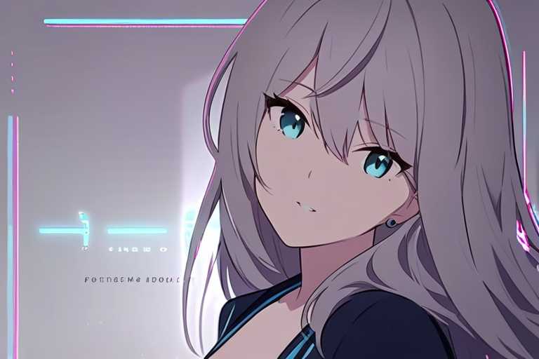
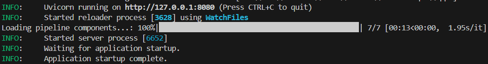
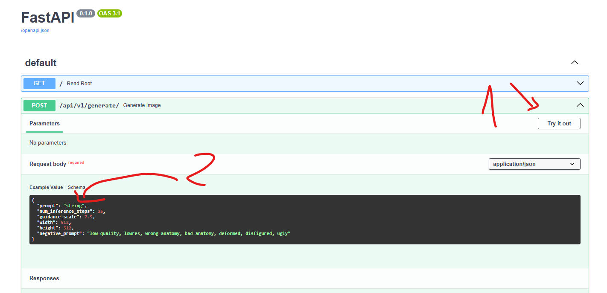
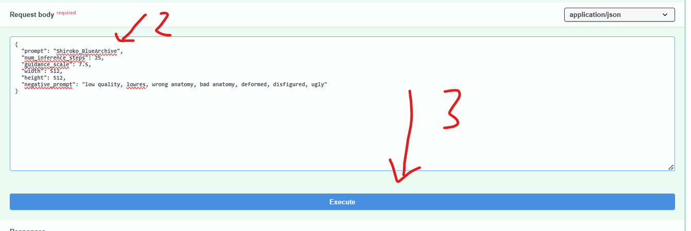
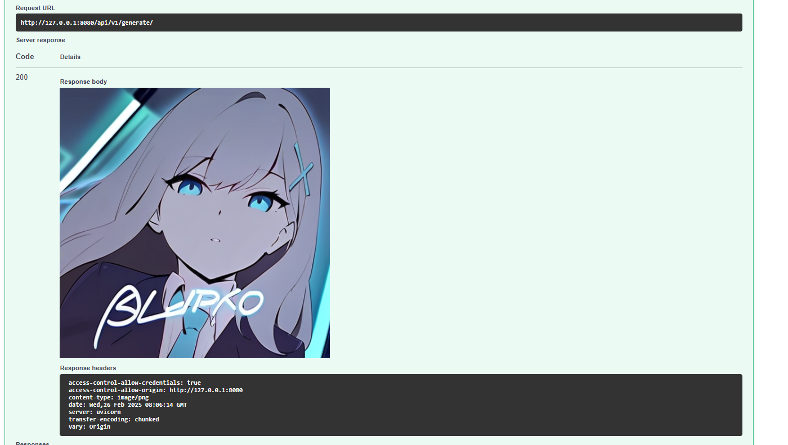

# Blue Archive Art Style Image Generator API

This project provides an API to generate images in the **Blue Archive** art style using FastAPI. The API leverages the power of Stable Diffusion and Diffusers to produce high-quality images.

 

---

## Requirements

To get started, ensure you have the following Python packages installed:

```bash
pip install fastapi[all] diffusers transformers accelerate torch
```

---

## Choosing a Model (Optional)

By default, the project uses the model `John6666/baxl-v3-sdxl`. If you wish to use a different model, modify the `service.py` file.

```python
scheduler = EulerDiscreteScheduler.from_pretrained("John6666/baxl-v3-sdxl", subfolder="scheduler")
pipeline = DiffusionPipeline.from_pretrained(
    "John6666/baxl-v3-sdxl",
    scheduler=scheduler,
    use_safetensors=True,
    # torch_dtype=torch.float16
)
```

### Original Model Source
The original model used in this project is derived from **BAXL**. You can find the link to the model [here](https://civitai.com/models/212253/baxl-or-blue-archive-flat-celluloid-style-fine-tune-or-kohaku-d-and-animagine-xl-v3).

---

## Running the Project

1. Start the FastAPI server:
   ```bash
   uvicorn main:app --reload --port 8080
   ```

2. Access the API documentation at:
   ```
   http://127.0.0.1:8080/docs
   ```

---

## Using the API

### Step 1: Test the Endpoint `/api/v1/generate/`

1. Navigate to the `/docs` page in your browser.
    

2. Click **Try it out** on the `/api/v1/generate/` endpoint.
   

3. Enter your **prompt** and other parameters (e.g., `width`, `height`) in the input fields and click **Execute**.
    
---

### Step 2: View the Result

The API will return the generated image:

 
---

## Features

- Generate high-quality images in the Blue Archive art style.
- Fully customizable with prompts and other parameters (e.g., resolution, steps, and guidance scale).
- Easily switch between models for different styles or outputs.

---

Feel free to contribute or report any issues! 🎨
